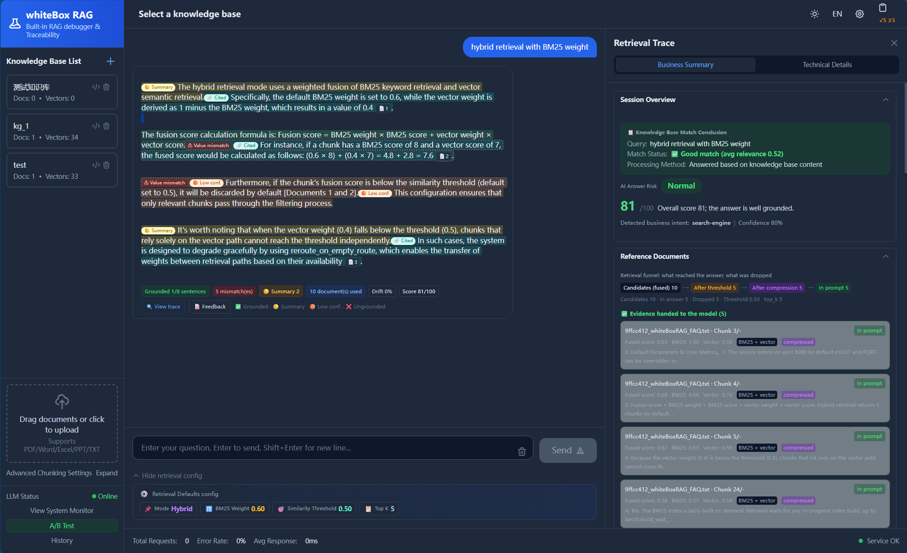
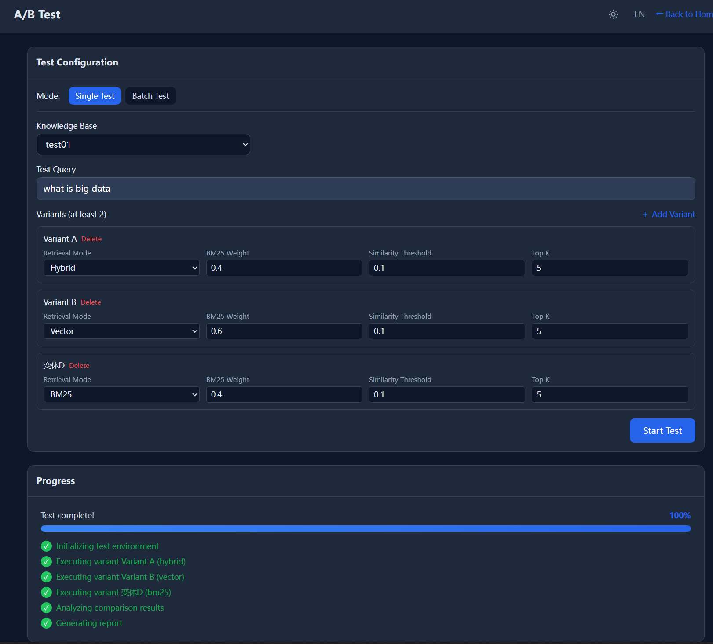
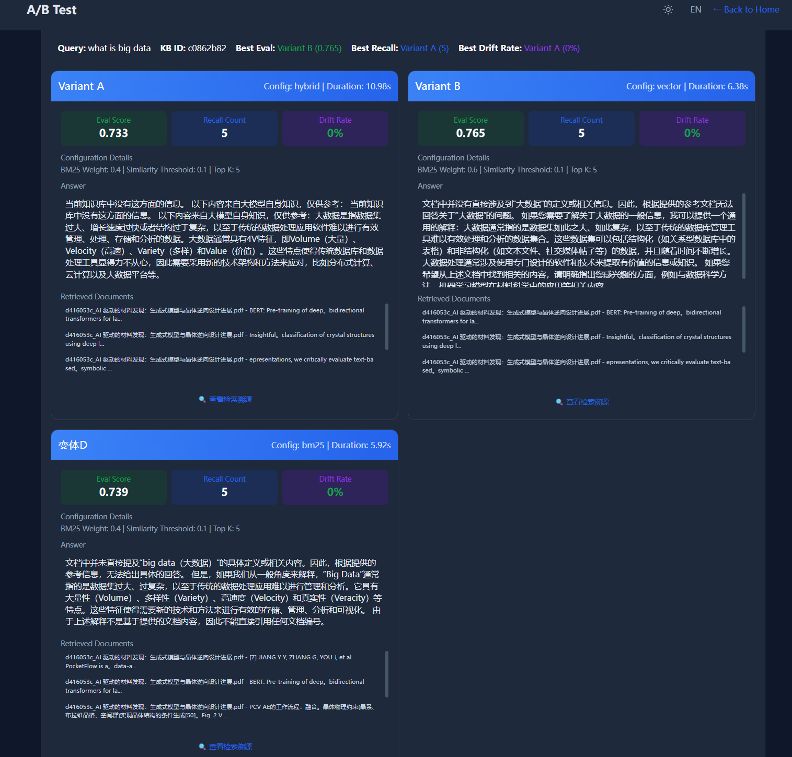

# whiteBoxRAG

> whiteBoxRAG delivers full transparency for intermediate steps from user Query to complete RAG execution. Extracted from a real‑world production RAG project, this powerful tool facilitates query tracing, root‑cause analysis and pinpointing directions for further optimization. It runs on an 8 GB CPU‑only machine with per‑sentence citation support. As a fully on‑premises solution with built‑in RAG debugger (FastAPI + LlamaIndex + ChromaDB + Ollama), it provides sentence‑level provenance, retrieval root‑cause diagnostics and an A/B‑testable retrieval pipeline to replace opaque black‑box RAG.

Note: It is designed to be internal RAG debugging, not for production use purpose.

Target Audience: RAG developers, researchers, and users who want to understand the inner workings of RAG systems.

[English](README.md) | [中文文档](README_ZH.md)

<!-- Static shields.io badges render without a repository slug. -->
[](https://github.com/yiyang-aistack/whiteboxRAG/actions/workflows/ci.yml)


### Try it in 30 seconds

```bash
ollama pull qwen2.5:7b && ollama pull nomic-embed-text   # one-time model download (~5 GB)

cp .env.example .env            # runtime settings — required; the app refuses to start without it
uv sync                         # terminal 1: create .venv + install the locked dependencies
uv run python main.py           #             env check, then the API on http://localhost:8080
uv run python scripts/seed_demo.py   # terminal 2: seed a demo KB, ask a question, print the trace
```

No uv yet? Install it once (`pip install uv`, `winget install --id=astral-sh.uv -e`, or
`curl -LsSf https://astral.sh/uv/install.sh | sh`). `uv run python main.py --install` performs the
`uv sync` for you — dependencies are locked in `uv.lock`, so every machine gets the same versions.

Then open <http://localhost:8080>. Prefer containers? `docker compose up -d` starts Ollama, pulls the
models and boots the app with a single command — see [Docker](#docker-compose-recommended).

<details>
<summary>What <code>python scripts/seed_demo.py</code> prints</summary>

```text
==> Asking: 混合检索里 BM25 的默认权重是多少？

==============================================================================
ANSWER
==============================================================================
混合检索默认启用，BM25 的默认权重为 0.4，向量权重为 0.6。[1]

------------------------------------------------------------------------------
RETRIEVAL
------------------------------------------------------------------------------
  mode=hybrid  has_results=True  chunks=3  duration=2.7s
  [1] score=0.031 source=whiteBoxRAG_FAQ.txt
      whiteBoxRAG 产品说明与常见问题（演示知识库） 二、默认参数与核心指标 ...

------------------------------------------------------------------------------
SENTENCE-LEVEL TRACING (the white-box part)
------------------------------------------------------------------------------
  [CITE] cited document [n] is part of the retrieved context
        混合检索默认启用，BM25 的默认权重为 0.4，向量权重为 0.6。[1]
        basis=citation
  sentences=1  citation_verified=1  direct_quote=0  summary=0  drift=0  unverified=0  drift_rate=0.0

------------------------------------------------------------------------------
EVALUATION
------------------------------------------------------------------------------
  overall_score=0.86  is_passing=True
  retrieval_recall=1.0 (target=0.7, pass=True)
  answer_faithfulness=0.95 (target=0.7, pass=True)
```

Illustrative: the wording depends on the model, the retrieved chunks and the scenario profile.
</details>

## Overview

whiteBoxRAG is a production-oriented RAG platform that keeps every component on-premises: document parsing, embedding, vector storage, hybrid retrieval, LLM inference, tracing, and evaluation all run locally. It targets teams that need a transparent ("white-box") knowledge assistant without sending data to third-party APIs, while still supporting OpenAI as an alternative LLM provider.

The name is the promise: instead of a black box, every stage stays inspectable — the built-in **RAG debugger** shows which chunk supported which sentence and why a document was not retrieved, so failures get diagnosed instead of guessed at.

The system ships with a build-free web frontend, a 58-endpoint REST API, scenario-based configuration, sentence-level answer tracing with citation verification, business-scope boundary detection, a rule engine that learns from user feedback, A/B testing for retrieval pipelines, and a built-in evaluation framework.

## Highlights

| | What you get |
|---|---|
| **Sentence-level provenance** | Citations first: a sentence whose `[doc_id]` marker maps onto a chunk that was really in the prompt is attributed to that chunk (*citation verified* — evidence). The rest are embedded and matched against the chunks at two scales, then labelled *direct evidence*, *summary*, *low confidence* or *unsupported drift*, with the UI stating plainly that this is a similarity heuristic and not a fact check. Sentences the tracer could not evaluate are reported as *unverified* instead of being counted as hallucinations. |
| **Why a document was missed** | Recall diagnostics answer "the document exists, so why did it not show up?" with a root cause: metadata filtering, a score just below the threshold, a retrieval-mode mismatch, or missing keywords. |
| **The answer disagrees with the source** | Structured contradiction detection compares the numbers, amounts, durations, dates and polarity phrases of the answer against the chunks that were actually in the prompt, so "the document says 0.4 and the model wrote 0.6" is reported with both values instead of slipping through a substring check. |
| **Feedback becomes rules** | Wrong answers, missing recall and intent errors accumulate in a rule engine; once a pattern crosses `rule_engine.min_feedback_count` it becomes a business rule whose live hit-rate is reported back through the API. |
| **Tune with evidence, not vibes** | Scenario profiles, a built-in evaluation framework (retrieval quality, faithfulness, semantic consistency, citation coverage, relevance, hallucination rate, rejection accuracy) with configurable weights, pass lines and rubric versioning, plus A/B testing of retrieval configurations. |
| **Runs where the data is** | 8 GB RAM / 4 CPU, no Redis, no MySQL, no broker. Vectors, documents, traces and task state are plain local files; inference is local Ollama, with OpenAI as an opt-in provider. |
| **Nothing leaves the machine by default** | Parsing, embedding, retrieval and generation stay on host; sensitive values come from `.env` and are never stored in the checked-in YAML. |

## Screenshots

| Tracing panel (business + technical views) | A/B test setup | A/B test results |
|---|---|---|
|  |  |  |
| Match verdict, recall summary and per-sentence ✅/⚠️/❌ verdicts; the technical view adds the query-rewrite trace, BM25 vs vector vs fused scores and per-sentence similarity. | Configure retrieval mode, BM25 weight, similarity threshold and `top_k` per variant. | Side-by-side evaluation score, recall count and drift rate, plus averages across variants. |

## How it compares

A feature-by-feature bingo against other ecosystems would be unfair and would age badly. This is the gap whiteBoxRAG is built to close:

| Concern | Typical RAG demo | whiteBoxRAG |
|---|---|---|
| Provenance | Shows the retrieved chunks next to the answer | Per-sentence verdict plus citation validation |
| Missed retrieval | Silent | Root-cause diagnosis for the missed document |
| User feedback | Stored and forgotten | Aggregated into effective, measurable rules |
| Tuning | Edit code and hope | Scenario profiles + evaluation metrics + A/B testing |
| Footprint | Vector service, broker or database | Local files on an 8 GB CPU box |
| Language | English-only or hardcoded | zh-CN / en-US driven by `Accept-Language` |

## Key Features

**Lightweight by design**
- Runs on an 8 GB CPU machine with no Redis, MySQL, or message broker
- Vectors, documents, logs, traces, and task state stored as local files
- Minimal dependency surface for fast deployment

**Document processing**
- Multi-format parsing: PDF, Word (`.docx`/`.doc`), TXT, Excel (`.xlsx`/`.xls`), PowerPoint (`.pptx`)
- Magic-number MIME validation alongside extension checks to block disguised uploads
- Scenario-driven chunking strategies with per-knowledge-base overrides
- Asynchronous ingestion with real-time progress tracking

**Retrieval**
- Hybrid retrieval combining BM25 (jieba-tokenized) and dense vector search with configurable weights
- Similarity threshold filtering, cross-result reranking, and context compression
- Query rewriting: synonym expansion, typo correction, and stop-word purification, all backed by hot-reloadable YAML dictionaries
- Graceful degradation when retrieval returns no results

**Answer quality and safety**
- Enforced citation format: the LLM must annotate claims with `[doc_id]` markers, which are then validated against the documents actually placed in the prompt
- Sentence-level tracing in two routes: citation verification first (`citation_verified`, evidence), then a similarity heuristic (direct quote / summary / low-confidence / unsupported drift) that the UI labels as a heuristic, with unverifiable sentences marked `unverified` rather than counted as hallucinations
- Business-scope boundary detection (OOD) via keyword whitelist/blacklist plus LLM semantic judgment
- Circuit breaker that opens on error-rate or latency spikes to protect the LLM backend

**Observability and tuning**
- Recall diagnostics that explain why a specific document was missed (metadata filter, score threshold, mode mismatch, keyword gap)
- Evaluation framework measuring retrieval quality (mean fused score, score spread), grounding (faithfulness, semantic consistency, citation coverage), relevance, hallucination rate and rejection accuracy, with configurable weights, calibrated pass lines and a `rubric_version` stamped on every result
- Rule engine that aggregates user feedback into business rules and reports their live effectiveness
- A/B testing to compare retrieval configurations side by side
- Performance monitoring, structured logging, and conversation history analytics

**Operations**
- Per-IP API rate limiting with exemptions for static assets and health checks
- Internationalization (Chinese `zh-CN` and English `en-US`) driven by `Accept-Language`
- Sensitive configuration (API keys) loaded from environment variables, never stored in plaintext
- Scheduler for periodic document optimization and daily analysis tasks

## Technology Stack

| Layer | Technology |
|-------|-----------|
| Web framework | FastAPI, Uvicorn, Gunicorn |
| RAG framework | LlamaIndex 0.10 |
| Vector store | ChromaDB (local persistent) |
| Sparse retrieval | rank-bm25 with jieba tokenizer |
| LLM / Embedding | Ollama (qwen2.5:7b, nomic-embed-text) or OpenAI |
| Document parsing | pypdf, python-docx, openpyxl, python-pptx, BeautifulSoup |
| Configuration | PyYAML, python-dotenv |
| Rate limiting | slowapi |
| File type validation | python-magic |
| Frontend | Vanilla HTML/CSS/JS, Tailwind CSS CDN, SSE streaming |
| Deployment | Docker, Gunicorn |

## Project Structure

```
whiteBoxRAG/
├── api/                       # API layer
│   ├── api.py               # FastAPI app, middleware, lifespan
│   └── routes/               # Modular route handlers
│       ├── knowledge.py      # Knowledge base CRUD, file upload, synonym/typo management
│       ├── chat.py           # Streaming Q&A, tracing, feedback, rules, A/B testing, history
│       ├── monitor.py        # Performance stats, logs, async task tracking
│       ├── scenario.py       # Scenario config inspection and validation
│       ├── evaluation.py     # RAG evaluation and report generation
│       └── document_optimizer.py  # Document analysis and optimization
├── core/                      # Core RAG pipeline
│   ├── document_parser.py    # Multi-format parsing and chunking
│   ├── vector_store.py       # ChromaDB collection management
│   ├── retriever.py          # Hybrid retrieval with background BM25 indexing
│   ├── llm_adapter.py        # Unified LLM provider abstraction (Ollama/OpenAI)
│   ├── llm_pipeline.py       # Streaming Q&A pipeline with citation enforcement
│   ├── boundary_detector.py  # Business-scope OOD detection
│   ├── circuit_breaker.py    # Error-rate and latency circuit breaker
│   ├── query_rewriter.py     # Synonym expansion and query purification
│   ├── typo_checker.py       # Typo correction rules
│   ├── rule_engine.py        # Feedback-driven rule engine with batched writes
│   ├── evaluator.py          # RAG evaluation metrics
│   ├── recall_diagnostic.py  # Non-recall root-cause analysis
│   ├── sentence_tracing.py   # Sentence-level citation tracing
│   ├── contradiction.py      # Structured answer/source contradiction detection
│   ├── intent_classifier.py  # Business intent classification
│   └── trace.py              # Q&A trace persistence
├── service/                   # Service layer
│   ├── logger.py             # Structured file logging
│   ├── async_tasks.py        # Background task manager
│   ├── monitor.py            # Performance metrics collection
│   ├── rate_limiter.py       # API rate limiting
│   ├── scheduler.py          # Cron-based scheduled tasks
│   ├── text_split.py         # Shared sentence splitter (offsets) for tracing, metrics and streaming
│   └── i18n.py               # Internationalization
├── config/                    # Configuration
│   ├── settings.yaml         # Global configuration
│   ├── synonym_dict.yaml     # Synonym dictionary (hot-reloadable)
│   ├── typo_dict.yaml        # Typo correction dictionary (hot-reloadable)
│   └── scenarios/            # Scenario-specific configs
├── static/                    # Browser frontend (no build step)
│   ├── index.html            # Chat UI markup (styles + scripts are external)
│   ├── admin.html            # Knowledge base administration
│   ├── ab_test.html          # A/B test workspace
│   ├── css/                  # Page styles: index.css / ab_test.css / admin.css
│   ├── js/                   # Page scripts (shared theme.js + one file per feature area)
│   └── i18n.js               # zh-CN / en-US strings for the UI
├── storage/                   # Persistent data (mounted as a Docker volume)
│   ├── vectordb/             # ChromaDB
│   ├── documents/            # Original documents
│   ├── traces/               # Q&A trace records
│   ├── tasks/                # Async task state
│   ├── monitor/              # Monitoring snapshots
│   └── logs/                 # Application logs
├── deploy/                    # Deployment scripts
├── scripts/seed_demo.py       # One-command demo: seed a KB, ingest, ask, print the trace
├── examples/demo/             # Sample document used by the demo script
├── docs/ARCHITECTURE_ZH.md    # Module / API / configuration specification (Chinese)
├── tests/                     # Unit and integration tests
├── tools/                     # Log analysis and i18n linting utilities
├── docker-compose.yml         # Ollama + models + app in one command
├── main.py                    # One-click startup script
├── pyproject.toml             # Project metadata + dependencies (runtime + dev group)
├── uv.lock                    # Locked dependency set — committed on purpose
└── .python-version            # Interpreter pin for uv (3.12)
```

## Quick Start

### Prerequisites~~~~

| Requirement | Notes |
|-------------|-------|
| Python 3.12+ | Pinned by `.python-version`; uv installs and manages the interpreter itself |
| [uv](https://docs.astral.sh/uv/) 0.10+ | Creates `.venv` and installs exactly what `uv.lock` pins (`uv sync`) |
| Ollama 0.1.25+ | listening on `:11434`, with both models pulled |
| Resources | 8 GB RAM / 4 CPU / 20 GB disk minimum (see [Environment Requirements](#environment-requirements)) |

```bash
ollama serve                                                   # start the local Ollama daemon
ollama pull qwen2.5:7b && ollama pull nomic-embed-text:latest  # ~5 GB, one time only
```

Model names and the Ollama endpoint are configurable through `.env` (`OLLAMA_LLM_MODEL`,
`OLLAMA_EMBEDDING_MODEL`, `OLLAMA_BASE_URL`) — see [Environment Variables](#environment-variables).

### One-Click Startup (recommended)

```bash
# First run: copy the runtime settings file (the app exits if .env is missing), then
# uv sync (creates .venv, installs the locked runtime dependencies) and start
cp .env.example .env
uv run python main.py --install

# Development mode with auto-reload (--install --dev also installs pytest / flake8)
uv run python main.py --install --dev

# Production mode (skips the environment check, installs nothing)
uv run python main.py --no-check

# Custom host/port
uv run python main.py --host 0.0.0.0 --port 8080
```

`python main.py --install` works too: it drives `uv sync` for you and then restarts itself inside
`.venv`. Use `uv sync --no-dev` when you only need the runtime dependencies.

### Manual Setup

```bash
uv sync                                  # .venv + runtime and dev dependencies from uv.lock
uv run python -m uvicorn api.api:app --host 0.0.0.0 --port 8080
```

| Command | Effect |
|---------|--------|
| `uv sync` | Create/update `.venv` from the lockfile (runtime + `dev` group) |
| `uv sync --no-dev` | Runtime dependencies only (what the production image ships) |
| `uv sync --locked` | Fail instead of updating `uv.lock` — used by CI and Docker |
| `uv run <cmd>` | Run a command inside `.venv` (syncing first when needed) |
| `uv lock` | Re-resolve `uv.lock` after editing `pyproject.toml` |

Equivalently, activate the environment once — `.venv\Scripts\activate` on Windows,
`source .venv/bin/activate` elsewhere — and call `python` directly.

Behind a slow or blocked PyPI, point uv at a mirror for that command only (uv ignores `.env` files,
so set the variable in your shell / CI / Dockerfile):
`UV_DEFAULT_INDEX=https://pypi.tuna.tsinghua.edu.cn/simple uv sync`.

### Docker (Compose, recommended)

```bash
docker compose up -d          # builds the image, starts Ollama, pulls both models, boots the API
docker compose logs -f app    # follow the application log
docker compose down           # stop everything (models stay in the ollama-models volume)
```

`docker-compose.yml` wires the app to the Ollama container via `OLLAMA_BASE_URL=http://ollama:11434`
and uses a one-shot init container to pull `qwen2.5:7b` + `nomic-embed-text` **before** the API starts,
so the very first request already works. This requires Docker Compose v2 (`docker compose`, not the
legacy `docker-compose` script).

### Docker (single container)

```bash
docker build -t whiteboxrag:latest -f deploy/Dockerfile .
docker run -d --name rag-system -p 8080:8080 \
  -v "$(pwd)/storage:/app/storage" \
  --memory=8g \
  -e OLLAMA_BASE_URL=http://host.docker.internal:11434 \
  whiteboxrag:latest
```

On Windows PowerShell, write the volume as `"${PWD}/storage:/app/storage"`.

> **Ollama is not inside the image.** A container cannot reach the host through `localhost` — that
> points at the container itself — so pass `OLLAMA_BASE_URL=http://host.docker.internal:11434`
> (Docker Desktop) or the address of your own Ollama host. Without it, `/api/health` may still answer
> while every LLM call fails with a connection error.

### Verify the Deployment

```bash
# 1. Health check  ->  {"status": "ok", ...}
curl http://localhost:8080/api/health

# 2. End-to-end check: creates a knowledge base, ingests a document, asks a question and
#    prints the sentence-level trace. Nothing to fill in by hand.
python scripts/seed_demo.py

# 3. Or drive the REST API manually:
curl -X POST http://localhost:8080/api/knowledge/create \
  -H "Content-Type: application/json" \
  -d '{"name": "Product Docs", "description": "User manuals and specs"}'   # -> {"kb_id": "..."}

curl -X POST http://localhost:8080/api/knowledge/<kb_id>/upload \
  -F "file=@/path/to/document.pdf"                                        # -> {"task_id": "..."}

curl -X POST http://localhost:8080/api/chat/stream \
  -H "Content-Type: application/json" \
  -d '{"kb_id": "<kb_id>", "query": "What is the warranty period?", "stream": false}'
```

`stream: false` returns the complete trace payload (answer, retrieval context, per-sentence verdicts,
evaluation); use `stream: true` for token-level SSE. Open `http://localhost:8080` in a browser for the
built-in UI.

### No Ollama? Point it at OpenAI

```bash
cp .env.example .env
```

```dotenv
# .env
LLM_PROVIDER=openai
OPENAI_API_KEY=sk-...
```

`.env` overrides `config/settings.yaml` (see [Environment Variables](#environment-variables)), so the
same code path is used for both providers.

## Configuration

All runtime configuration lives in `config/settings.yaml`. The most important sections:

| Section | Key | Purpose |
|---------|-----|---------|
| `llm.provider` | `ollama` / `openai` | Switch LLM backend |
| `ollama.llm_model` | `qwen2.5:7b` | LLM model name |
| `ollama.embedding_model` | `nomic-embed-text:latest` | Embedding model |
| `vector_store.top_k` | `5` | Number of vectors to retrieve (component-level; the hybrid retriever uses `retriever.top_k`) |
| `vector_store.similarity_threshold` | `0.1` | Minimum similarity score (component-level; the hybrid retriever uses `retriever.similarity_threshold`) |
| `retriever.mode` | `vector` / `bm25` / `hybrid` | Retrieval strategy |
| `retriever.bm25_weight` | `0.6` | BM25 weight in hybrid mode (vector weight = 1 − this) |
| `retriever.top_k` | `5` | Chunks kept for the prompt |
| `retriever.similarity_threshold` | `0.5` | Minimum similarity for a hit to reach the prompt |
| `retriever.reroute_on_empty_route` | `true` | A route that returned nothing gives up its fusion weight for that query (`debug_info.route_degraded`); turn it off to compare raw configurations |
| `bm25.build_wait_ms` | `500` | How long a retrieval waits for an in-flight BM25 build before degrading to the remaining route(s) |
| `retriever.query_rewrite_enabled` | `true` | Run the query-rewrite stage |
| `retriever.rerank_enabled` | `true` | Run the rerank stage (`rerank_top_k` collapses to `top_k` when off) |
| `retriever.compression.enabled` | `true` | Context compression before LLM call |
| `document_parser.chunk_size` | `512` | Chunk size in characters |
| `document_parser.max_file_size` | `50` | Max upload size in MB |
| `boundary.enabled` | `true` | Business-scope boundary detection |
| `circuit_breaker.failure_threshold` | `50` | Error rate (%) that trips the breaker |
| `api.rate_limit` | `60` | Requests per minute per IP |
| `trace.enabled` | `true` | Q&A trace recording |
| `recall_diagnostic.enabled` | `true` | Non-recall root-cause analysis |
| `contradiction.enabled` | `true` | Structured answer/source contradiction check (numbers, amounts, dates, polarity) |
| `contradiction.relative_tolerance` | `0.2` | Relative difference above which a claim mismatch is reported |

### Environment Variables

Sensitive and environment-specific values (API keys, service URLs, model names) are managed through environment variables, loaded from a `.env` file at the project root. Environment variables take priority over `settings.yaml`. Copy `.env.example` to `.env` and fill in the values:

```bash
cp .env.example .env
```

Key variables (full list in `.env.example`):

| Variable | Purpose | Default |
|----------|---------|---------|
| `LLM_PROVIDER` | LLM backend: `ollama` or `openai` | `ollama` |
| `OLLAMA_BASE_URL` | Ollama server URL | `http://localhost:11434` |
| `OLLAMA_LLM_MODEL` | Ollama LLM model name | `qwen2.5:7b` |
| `OLLAMA_EMBEDDING_MODEL` | Ollama embedding model | `nomic-embed-text:latest` |
| `OPENAI_API_KEY` | OpenAI API key (required when `LLM_PROVIDER=openai`) | — |
| `OPENAI_BASE_URL` | OpenAI API base URL (supports proxies) | `https://api.openai.com/v1` |
| `API_KEY` | Reserved — **not enforced**: the API has no built-in authentication, see [Security](#security) | — |
| `API_RATE_LIMIT` | Max requests per minute per IP | `60` |

The `.env` file is loaded automatically by `config/__init__.py` via `python-dotenv` and injected into the config dict centrally — no other module reads environment variables directly.

### Scenario Configuration

Scenarios bundle chunking, retrieval, prompt, and evaluation parameters into a single named profile (e.g. `customer_service`, `technical_doc`). Each knowledge base can bind to a scenario so that a customer-service KB gets shorter chunks and friendlier prompts while a technical-doc KB gets larger chunks and stricter citation rules. Scenario files live in `config/scenarios/` and can be validated through the `/api/scenario/{id}/validate` endpoint.

## API Reference

The system exposes 59 endpoints across six modules. Interactive documentation is available at `http://localhost:8080/docs` (Swagger UI) and `/redoc`.

### Knowledge Base Management

| Method | Endpoint | Description |
|--------|----------|-------------|
| POST | `/api/knowledge/create` | Create a knowledge base |
| DELETE | `/api/knowledge/{kb_id}` | Delete a knowledge base |
| GET | `/api/knowledge/list` | List all knowledge bases |
| GET | `/api/knowledge/{kb_id}` | Get knowledge base details |
| POST | `/api/knowledge/{kb_id}/upload` | Upload a document (multipart) |
| GET | `/api/knowledge/{kb_id}/status` | Get ingestion progress |
| GET | `/api/knowledge/{kb_id}/files` | List files in a knowledge base |
| GET | `/api/knowledge/{kb_id}/files/{file_id}` | Get file metadata |
| PUT | `/api/knowledge/{kb_id}/files/{file_id}` | Replace a file |
| DELETE | `/api/knowledge/{kb_id}/files/{file_id}` | Delete a file |
| GET | `/api/knowledge/{kb_id}/raw/{file_id}` | Get raw document content |
| GET | `/api/knowledge/{kb_id}/chunks` | List chunks in a knowledge base |
| GET | `/api/knowledge/{kb_id}/chunks/{chunk_id}` | Get chunk detail with its vector |
| GET | `/api/knowledge/synonyms` | Get synonym dictionary |
| POST | `/api/knowledge/synonyms` | Add a synonym group |
| DELETE | `/api/knowledge/synonyms/{term}` | Delete a synonym group |
| POST | `/api/knowledge/synonyms/reload` | Hot-reload synonym dictionary |
| GET | `/api/knowledge/typos` | Get typo correction rules |
| POST | `/api/knowledge/typos` | Add a typo rule |
| DELETE | `/api/knowledge/typos/{typo}` | Delete a typo rule |
| POST | `/api/knowledge/typos/reload` | Hot-reload typo dictionary |

### Chat and Q&A

| Method | Endpoint | Description |
|--------|----------|-------------|
| POST | `/api/chat/stream` | Streaming Q&A via SSE |
| POST | `/api/chat/trace` | Get trace by trace_id |
| GET | `/api/chat/trace/{trace_id}` | Get trace by trace_id |
| GET | `/api/chat/health` | Check LLM service health |
| GET | `/api/chat/retrieval-defaults` | Default hybrid retrieval parameters (from `retriever:` in settings.yaml; the UI reads its defaults here) |
| POST | `/api/chat/simulate` | Hypothesis-mode Q&A with manually selected chunks |
| POST | `/api/chat/miss-scan` | On-demand full scan for relevant chunks that were never recalled |
| POST | `/api/chat/feedback` | Submit user feedback on an answer |
| GET | `/api/chat/rules` | List business rules |
| POST | `/api/chat/rules` | Create a business rule |
| DELETE | `/api/chat/rules/{rule_id}` | Delete a business rule |
| GET | `/api/chat/rule-effectiveness` | Get rule effectiveness report |
| GET | `/api/chat/rule-logs` | Get rule application logs |
| POST | `/api/chat/abtest` | Run an A/B comparison test |
| POST | `/api/chat/abtest/batch` | Run batch A/B tests |
| POST | `/api/chat/history` | Query conversation history |
| GET | `/api/chat/history/stats` | Get conversation statistics |
| DELETE | `/api/chat/history/{trace_id}` | Delete a conversation record |

### Scenario Management

| Method | Endpoint | Description |
|--------|----------|-------------|
| GET | `/api/scenario/list` | List available scenarios |
| GET | `/api/scenario/{scenario_id}` | Get scenario detail |
| GET | `/api/scenario/{scenario_id}/params` | Get resolved retrieval parameters |
| POST | `/api/scenario/{scenario_id}/validate` | Validate scenario configuration |

### Evaluation

| Method | Endpoint | Description |
|--------|----------|-------------|
| POST | `/api/evaluation/evaluate` | Evaluate a single Q&A pair |
| POST | `/api/evaluation/batch` | Batch evaluation |
| POST | `/api/evaluation/report` | Generate an evaluation report |
| GET | `/api/evaluation/report/{report_id}` | Get a report by ID |
| GET | `/api/evaluation/reports` | List evaluation reports |
| GET | `/api/evaluation/metrics` | Get metric definitions |

### Document Optimizer

| Method | Endpoint | Description |
|--------|----------|-------------|
| POST | `/api/document/analyze` | Analyze documents against query logs |
| POST | `/api/document/optimize` | Optimize documents |
| GET | `/api/document/issues` | List detected document issues |
| GET | `/api/document/coverage` | Get query coverage stats |
| GET | `/api/document/download/optimized` | Download optimized documents |
| POST | `/api/document/full-analysis` | Run the full analysis pipeline |

### Monitoring

| Method | Endpoint | Description |
|--------|----------|-------------|
| GET | `/api/monitor/stats` | Get performance statistics |
| GET | `/api/monitor/logs` | Query recent log lines |
| GET | `/api/monitor/tasks` | List async tasks |
| GET | `/api/monitor/task/{task_id}` | Get task detail |
| POST | `/api/monitor/stats/reset` | Reset statistics |
| GET | `/api/health` | System health check |

## Core Concepts

### Hybrid Retrieval

The retriever runs BM25 and dense vector search in parallel, then fuses results by a configurable weight (`retriever.bm25_weight`). BM25 indices are built in a background thread with versioning so that re-indexing never blocks incoming queries; a retrieval waits `bm25.build_wait_ms` for an in-flight build, and a route that returned nothing gives up its fusion weight for that query (`retriever.reroute_on_empty_route`) so a missing route can never cap the fused score below `retriever.similarity_threshold`. Retrieved chunks pass through similarity-threshold filtering, optional reranking, and context compression before reaching the LLM.

### Boundary Detection

Before retrieval, the boundary detector decides whether a query falls inside the business scope. It combines a keyword blacklist (immediate rejection), a keyword whitelist (immediate acceptance), and an LLM-based semantic check against configured business topics. Out-of-domain queries are rejected with a configurable message, saving LLM cost and preventing off-topic answers.

### Citation Enforcement and Tracing

The system prompt forces the LLM to mark every factual claim with `[doc_id]` references, and the pipeline validates that each marker points to a document that was really in the prompt. Every sentence of the answer is then traced by two routes, in this order:

1. **citation** — the sentence carries a marker and that ordinal maps onto a retrieved chunk, so the sentence is attributed to that chunk (`citation_verified`). This is evidence, not a similarity score.
2. **similarity** — no usable marker: the sentence is embedded and matched against the chunks at two scales (sentence-vs-chunk-sentence, sentence-vs-full-chunk) and labelled a direct quote, summary, low-confidence or unsupported drift. The verdict combines absolute floors with the sentence's rank inside this answer's own score distribution, and the UI presents it as a *similarity heuristic* — it says which chunk the sentence is closest to, never that the claim is true.

Sentences the tracer could not evaluate at all (embedding backend down) are reported as `unverified` and are excluded from the drift/hallucination rate instead of being counted as hallucinations. Verdicts carry character offsets, so the browser attributes a badge to a sentence by position rather than by re-deriving sentence indexes with its own code (all modules share one splitter, `service/text_split.py`).

### Contradiction Detection

Provenance says where a sentence came from; it does not say whether the sentence is *right*. `core/contradiction.py` answers the second question by comparing claims instead of substrings, and it runs on the normal Q&A path, so a trace can flag the sentence itself.

- **Claims, not substrings.** A claim is a number plus its unit (duration, length, weight, money, percentage, count, calendar date) or a polarity phrase (支持 vs 不支持, free vs paid, full refund vs partial refund). Units are normalised to a base, so 7 天 and 168 小时 are the same claim and 1 万元 equals 10000 元; different currencies are never compared.
- **Thresholds that catch real errors.** A difference must exceed `contradiction.relative_tolerance` (0.2 by default), so the README example — the document says 0.4, the model answers 0.6 — is reported at a 33% relative difference. Percentages additionally use `percent_point_tolerance` (5 points), because 50% vs 60% is only 17% relative; dates use `date_tolerance_days`.
- **Reconciliation before accusation.** A claim is only reported when no in-scope source claim can explain it: a document that lists both 0.4 and 0.6 does not contradict an answer that says 0.6. Comparisons are scoped to sentences that share a topic token, so two unrelated numbers in one chunk are never "contradicting" each other.
- **In the trace.** Findings carry the answer sentence's offsets, the source chunk id, the source sentence and the source snippet's offsets, so the UI can mark the sentence (a sentence can be a perfect quote *and* wrong on a number) and highlight the source text. They are also served by `POST /api/chat/simulate`, where dropping a chunk is exactly what can turn a supported answer into a contradicted one.

### Rule Engine

User feedback (wrong answer, missing recall, intent error) accumulates in the rule engine. Once feedback for a pattern exceeds `rule_engine.min_feedback_count`, the engine proposes a business rule. Rules are applied at query time and their hit rate is reported through `/api/chat/rule-effectiveness`. The engine batches writes to disk via an in-memory buffer flushed every 10 seconds or 50 changes to avoid I/O spikes.

### Recall Diagnostics

When a relevant document is missing from results, the recall diagnostic module explains why: metadata filtering excluded it, its score sat just below the threshold, only one retrieval mode caught it, or the query lacked the right keywords. Diagnostics run asynchronously and cap full scans at `recall_diagnostic.full_scan_limit` documents to protect throughput.

### Evaluation Framework

The evaluator scores every answer against ten metrics in three layers — retrieval quality (mean
fused score, score spread), grounding (faithfulness, semantic consistency, citation coverage),
relevance, and safety (hallucination rate, rejection accuracy, empty response, length) — and
turns them into one number you can argue with:

* **One rubric, two views.** Each metric is normalized onto a credit scale anchored at its pass
  line: `value == target` earns exactly `pass_score` (0.7) and the ideal value earns 1.0. The
  overall score is the *weighted* mean of those credits and `is_passing` is that same score plus
  named gates (`score`, `weight_coverage`, `not_empty_response`, `hallucination_within_limit`), so
  the number and the verdict can never disagree.
* **Weights and pass lines are configuration** (`evaluation.weights`, `evaluation.target_values`
  in `config/settings.yaml`, overridable per scenario). Grounding carries the most weight because
  that is what the product sells; the pass lines were calibrated against the traces in
  `storage/traces` with `scripts/evaluator_recalc.py`.
* **Fail closed, and say what was not measured.** A metric that could not be computed (embedding
  outage) scores 0 and is reported as an error instead of being dropped; a metric that does not
  apply (`rejection_accuracy` on an in-domain question) drops out and its weight is
  redistributed, with the lost share exposed as `weight_coverage`.
* **Attributable scores.** Every result carries `raw_score`, `adjustments` (low-retrieval cap,
  boundary-confidence penalty), `quality_flags`, `score_breakdown` and `rubric_version`; scores
  from different rubrics or scenarios are not comparable, which is why the A/B comparison also
  reports rubric-independent winners (`best_by_grounding`, `best_by_citation_coverage`).
* **Offline recalibration.** `scripts/evaluator_recalc.py` re-scores the stored traces with the
  current rubric code (no embeddings, no LLM) and prints per-metric pass rates, percentiles and
  the before/after distribution; `tests/test_evaluator.py` pins the invariants above.

Results can be compiled into shareable reports via the `/api/evaluation/report` endpoint, and the
metric catalogue (with the implementation behind each name) is served by
`GET /api/evaluation/metrics`.

## Deployment

### Production with Gunicorn

```bash
uv run gunicorn --bind 0.0.0.0:8080 --workers 1 --threads 4 --timeout 120 api.api:app

# Or with the bundled config
uv run gunicorn -c deploy/gunicorn.conf.py api.api:app
```

Single worker is recommended because the system keeps vector store and BM25 indices in process memory; multi-worker setups would duplicate this state.

### Environment Requirements

| Resource | Minimum | Recommended |
|----------|---------|-------------|
| CPU | 4 cores | 8 cores |
| RAM | 8 GB | 16 GB |
| Disk | 20 GB | 50 GB |
| OS | Ubuntu 20.04+ / Windows 10+ / macOS 12+ | — |

Detailed deployment instructions, Ollama model setup, performance tuning, and backup procedures are in `deploy/DEPLOY.md`.

## Testing

```bash
uv sync                                      # runtime + dev group (pytest, pytest-asyncio, flake8)

# The offline subset — exactly what CI runs, no server and no Ollama required
uv run pytest -q \
  tests/test_boundary_detector.py tests/test_query_rewrite.py tests/test_retriever.py \
  tests/test_regression.py tests/test_llm_citations.py tests/test_doc_analyzer.py \
  tests/test_abtest_integration.py tests/test_async_tasks_kb.py \
  tests/test_i18n_consistency.py tests/test_http_encoding.py \
  tests/test_parser.py tests/test_path_safety.py \
  tests/test_retrieval_funnel.py tests/test_chat_debug_endpoints.py \
  tests/test_retrieval_defaults.py tests/test_abtest_rules.py \
  tests/test_text_split.py tests/test_sentence_tracing.py \
  tests/test_streaming_trace_offsets.py tests/test_contradiction.py
  tests/test_retrieval_degradation.py tests/test_hybrid_disclaimer_dedupe.py

# Everything (the API/Ollama-dependent files need a running service)
uv run pytest tests/ -q

# i18n lint: backend + frontend dictionaries (zh-CN / en-US key, placeholder and
# "no Chinese left in en-US" checks), exits non-zero on drift
uv run python tools/check_i18n.py
```

Every test file also runs standalone, e.g. `uv run python tests/test_parser.py`.

| Test file | Covers | Runs in CI |
|-----------|--------|------------|
| `test_boundary_detector.py` | Business-scope OOD detection and its voting logic | ✅ |
| `test_query_rewrite.py` | Synonym expansion, typo correction, purification | ✅ |
| `test_retriever.py` | BM25 / vector / hybrid strategy switching | ✅ |
| `test_regression.py` | Regression suite for previously fixed defects | ✅ |
| `test_llm_citations.py` | Citation enforcement and validation | ✅ |
| `test_doc_analyzer.py` | Document analyzer and optimizer | ✅ |
| `test_abtest_integration.py` | A/B testing end to end | ✅ |
| `test_abtest_rules.py` | Rule engine and effectiveness persistence | ✅ |
| `test_async_tasks_kb.py` | Async ingestion tasks and KB metadata | ✅ |
| `test_i18n_consistency.py` | zh-CN / en-US translation parity, backend and frontend dictionaries | ✅ |
| `test_http_encoding.py` | UTF-8 response encoding | ✅ |
| `test_parser.py` | Multi-format parsing and chunking | ✅ |
| `test_path_safety.py` | Filename sanitisation, `safe_join` and traversal rejection | ✅ |
| `test_retrieval_funnel.py` | Retrieval funnel attribution (threshold / compression / top_k) | ✅ |
| `test_retrieval_defaults.py` | Retrieval defaults come from settings.yaml and are served to the UI; no hardcoded values in the pages | ✅ |
| `test_chat_debug_endpoints.py` | `/api/chat/simulate` and `/api/chat/miss-scan` debug endpoints | ✅ |
| `test_text_split.py` | Shared sentence splitter: decimals, abbreviations, lists, code fences, character offsets | ✅ |
| `test_sentence_tracing.py` | Sentence provenance: citation-first attribution, floors + relative rank, `unverified` on embedding failure, streaming == batch, no duplicate method definitions | ✅ |
| `test_streaming_trace_offsets.py` | `LLMPipeline.query_stream` end to end (stub adapter): streamed offsets slice back to each sentence, incremental verdicts == final verdicts, hybrid-mode disclaimer injected once and never traced live (including the model echoing it back), contradictions streamed and attached to the sentence | ✅ |
| `test_contradiction.py` | Structured contradiction detection: decimal-place errors, unit normalisation (7 天 == 168 小时, 1 万元 == 10000 元), percentage points, dates, polarity phrases, topic scope, settings-driven thresholds | ✅ |
| `test_retrieval_degradation.py` | An empty retrieval route must not empty the answer: BM25 in-flight build is awaited (`bm25.build_wait_ms`), weights are redistributed onto the live route (`retriever.reroute_on_empty_route`), the funnel reports the effective weights, and weight/threshold combinations that make a route mandatory are flagged | ✅ |
| `test_hybrid_disclaimer_dedupe.py` | The hybrid-answer disclaimer reaches the user exactly once: streamed duplicate dropped (offsets stay valid), finished answer collapsed whitespace-insensitively, a model that follows the format is not injected twice | ✅ |
| `test_api.py` | HTTP API contract | needs a live server |
| `test_bm25_simple.py` | BM25 index building | needs a live server |
| `test_hybrid_search_demo.py` | Hybrid retrieval demo | needs Ollama |
| `golden_test_set.json` | Golden Q&A pairs for evaluation runs | data |

`.github/workflows/ci.yml` runs the i18n lint, the offline subset, flake8 (`E9,F63,F7,F82`) and a
byte-compile pass on every push and pull request.

## Security

This is a **local-first** deployment: it ships without authentication, so its safety depends on where you expose it.

- **No built-in authentication.** Every endpoint is reachable by anyone who can reach the port, and the `API_KEY` setting is *reserved but not enforced* (see `.env.example`). Keep the service on a trusted network, bind it to localhost (`python main.py --host 127.0.0.1`), or put an authenticating reverse proxy in front of it.
- **CORS defaults to `*`.** `api.cors_origins` allows every origin out of the box, which means a web page you visit could drive your local instance. Narrow it to your own hosts and drop the `*` entry in production; credentials are only enabled once the list is explicit.
- **Rate limiting** is per client IP (`api.rate_limit`, default 60/min). `/static`, `/api/health`, `/docs`, `/openapi.json` and `/redoc` are exempt.
- **Upload and download paths are sanitized.** Client supplied names (multipart filenames, `trace_id`, `task_id`, `logger_name`, `file_name`) are reduced to a single path segment by `service/path_safety.py`, so a crafted name cannot read or write outside its directory. Use `safe_join()` for any new user-controlled path.
- **Secrets** (`OPENAI_API_KEY`, ...) come from `.env`, which is git-ignored; nothing sensitive is stored in `config/settings.yaml`.
- **Swagger UI** (`/docs`) is served unconditionally — disable or protect it if you make the service public.

If you need multi-user access control, terminate it at the proxy layer (or open an issue: an optional API-key middleware is on the roadmap).

## Roadmap

Not commitments, just the direction of travel — issues and PRs for any of these are welcome:

- [ ] Optional API-key middleware so the reserved `API_KEY` setting actually protects the API
- [ ] Reranker plug-in point (cross-encoder) with scenario-level selection
- [ ] Streaming evaluation so scores arrive alongside the tokens rather than after the answer
- [ ] Multi-tenant knowledge bases with per-tenant rule and scenario isolation
- [ ] Retrieval regression gates in CI using `tests/golden_test_set.json`
- [ ] Optional PostgreSQL/pgvector backend for teams that outgrow local ChromaDB

## Contributing

Issues and pull requests are welcome. Start with [CONTRIBUTING.md](CONTRIBUTING.md): it covers the
development setup, the offline test subset, the code conventions (English comments, i18n for any
user-facing string) and the pull-request checklist. Changes to behaviour should come with a test, and
`README.md` / `README_ZH.md` should stay in sync.

## License

[MIT](LICENSE) © whiteBoxRAG contributors. The project is intended for learning and research; review
your own data-handling requirements before deploying it against sensitive data.

## Acknowledgements

Built on [FastAPI](https://fastapi.tiangolo.com/), [LlamaIndex](https://www.llamaindex.ai/),
[ChromaDB](https://www.trychroma.com/), [Ollama](https://ollama.com/),
[rank-bm25](https://github.com/dorianbrown/rank_bm25) and [jieba](https://github.com/fxsjy/jieba).
Architecture and module-level details (Chinese) live in [`docs/ARCHITECTURE_ZH.md`](docs/ARCHITECTURE_ZH.md).